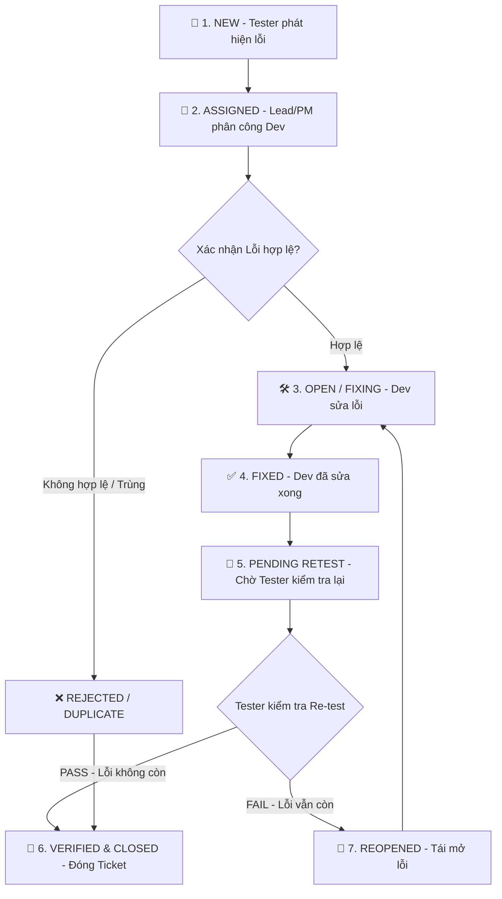

# 🐞 Sơ Đồ & Quy Trình Quản Lý Lỗi Phần Mềm (Bug / Defect Life Cycle)
### Dự án: PetCare Store Management System | Môn học: Kiểm thử phần mềm

---

## 📊 1. Sơ Đồ Vòng Đời Lỗi (Mermaid Bug Life Cycle Diagram)

---

## 📋 2. Bảng Giải Thích Chi Tiết Trạng Thái Lỗi

| Trạng Thái (Status) | Người Thao Tác | Mô Tả Chi Tiết Hành Động |
| :--- | :---: | :--- |
| **1. NEW (Mới phát hiện)** | Tester | Tester phát hiện lỗi bất thường và lập Bug Report đầy đủ thông tin (Steps to Reproduce, Severity, Priority). |
| **2. ASSIGNED (Đã phân công)** | Test Lead / PM | PM / Test Lead duyệt ticket và gán trách nhiệm sửa lỗi cho Developer phụ trách module tương ứng. |
| **3. OPEN / FIXING (Đang sửa)** | Developer | Developer phân tích nguyên nhân (Root Cause), lập kịch bản sửa code và khắc phục lỗi trên nhánh dev. |
| **4. FIXED (Đã sửa xong)** | Developer | Developer đã đẩy mã nguồn mới lên Server Test và chuyển ticket sang trạng thái chờ kiểm thử lại. |
| **5. PENDING RETEST** | Tester / QA | Lỗi đã có mặt trên phiên bản Build mới, chờ đội ngũ QC/QA chạy kịch bản kiểm thử lại. |
| **6. VERIFIED / CLOSED** | Tester | Tester xác nhận lỗi đã được khắc phục hoàn toàn ➔ Tiến hành ĐÓNG TICKET thành công. |
| **7. REOPENED (Tái mở lỗi)** | Tester | Lỗi chưa được giải quyết triệt để hoặc phát sinh lỗi liên đới ➔ Chuyển ticket về Developer sửa tiếp. |
| **8. REJECTED / DUPLICATE** | Lead / Dev | Lỗi không phải là lỗi phần mềm (do sai tài liệu/thao tác sai) hoặc đã được báo cáo trong Ticket khác. |

---

## 🚨 3. Phân Loại Mức Độ Nghiêm Trọng (Severity)

| Severity Level | Định Nghĩa | Ví Dụ Trong PetCare Store |
| :---: | :--- | :--- |
| **S1 - Critical** | Sập hệ thống, mất dữ liệu, rò rỉ token, không thể đặt dịch vụ. | Server sập khi ấn nút "Xác Nhận Đặt Lịch Hẹn". |
| **S2 - High** | Lỗi tính năng quan trọng nhưng còn luồng lách tạm thời. | Không thể tạo thú cưng mới từ màn hình cá nhân. |
| **S3 - Medium** | Lỗi logic phụ, giao diện hiển thị sai giá tiền. | Giá tiền hiển thị thiếu phân cách hàng nghìn (250000đ). |
| **S4 - Low** | Lỗi chính tả, màu sắc nút chưa theo thiết kế. | Sai chính tả từ "Grooming" thành "Groming". |

---

## 📄 4. File Microsoft Word (.docx) Đã Tạo

File Word chuyên nghiệp được định dạng sẵn bảng biểu, màu sắc và sơ đồ cấu trúc đã được tạo tại:
- 📁 Path: **`E:\Kiểm thử phần mềm\So_Do_Quan_Ly_Loi_PetCareStore.docx`**
